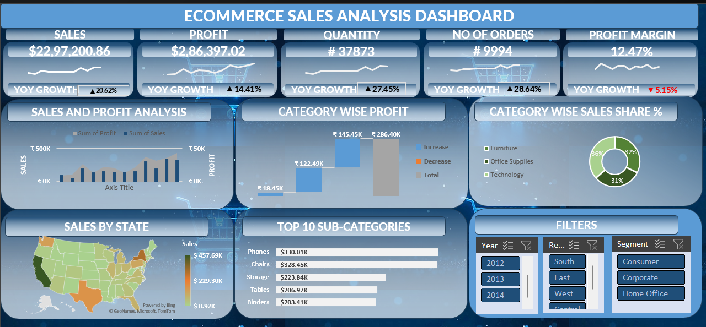

# Ecommerce-Sales-Analysis
# 🛒 Ecommerce Sales Analysis Dashboard (Excel)

## 📌 Project Overview
Developed an interactive Ecommerce Sales Dashboard using Microsoft Excel to analyze sales performance, profitability, and customer behavior.

The dashboard provides business insights through KPIs, trend analysis, category breakdown, and geographic sales distribution.

---

## 🛠 Tools & Techniques
- Microsoft Excel
- Pivot Tables
- Power Query
- Data Cleaning
- KPI Cards
- Data Visualization
- YoY Growth Analysis

---

## 📊 Key KPIs
- 💰 Total Sales: $22.97M
- 💵 Total Profit: $2.86M
- 📦 Quantity Sold: 37,873
- 🛒 Total Orders: 9,994
- 📈 Profit Margin: 12.47%

---

## 📈 Dashboard Features
- Sales & Profit Trend Analysis
- Category-wise Profit Breakdown
- Category Sales Share %
- Top 10 Sub-Categories
- State-wise Sales Map
- Interactive Filters (Year, Region, Segment)
- YoY Growth Indicators

---

## 📷 Dashboard Preview

---

## 🚀 Business Insights Derived
- Identified top-performing product categories
- Analyzed regional sales distribution
- Evaluated profitability trends
- Tracked year-over-year growth
- Improved KPI monitoring for decision-making

---

## 👨‍💻 Author
Chanjal C M  
Aspiring Data Analyst | SQL • Python • Power BI • Excel

